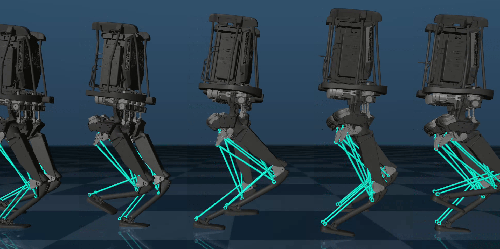

# MuJoCo Kangaroo Sim-to-Sim

Simple package to run locomotion policies on a [Kangaroo robot](https://pal-robotics.com/robot/kangaroo/) from PAL Robotics (1st version) simulated in [MuJoCo](https://mujoco.org/) for *sim-to-sim* validation.

Policy training was performed using [Isaac Lab](https://isaac-sim.github.io/IsaacLab/main/index.html) with the environment from [isaaclab_kangaroo](https://github.com/hucebot/isaaclab_kangaroo).

## Installation

You can install the package in a virtual environment via `pip install -e .`.

## Usage

The folder `script` contains a simple policy runner (`run_policy.py`) and three example policies (inside `script/policies`). In the example the desired velocity is selected randomly.

### Notes

The MuJoCo model of the Kangaroo robot is inside the folder `mujoco_kangaroo_sim2sim/kangaroo_mujoco`.
